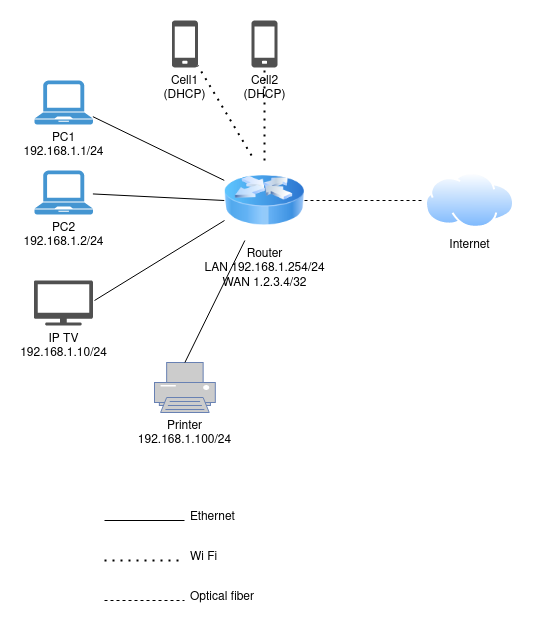

# Домашнее задание к занятию "3.8. Компьютерные сети, лекция 3"


1. Подключился к маршрутизатору. Посмотрел маршрут до своего публичного IP (реальные данные изменены):
    ```
    alex@example ~ $ telnet route-views.routeviews.org
    Username: rviews
    route-views>show ip route 1.2.3.4
    Routing entry for 1.2.3.0/24
    Known via "bgp 6447", distance 20, metric 0
    Tag 3303, type external
    Last update from 217.192.89.50 1w3d ago
    Routing Descriptor Blocks:
    217.192.89.50, from 217.192.89.50, 1w3d ago
      Route metric is 0, traffic share count is 1
      AS Hops 3
      Route tag 3303
      MPLS label: none
    route-views>show bgp 1.2.3.4
    BGP routing table entry for 1.2.3.0/24, version 2540214845
    Paths: (22 available, best #20, table default)
    Not advertised to any peer
    Refresh Epoch 1
    7660 4635 8359 13155
    203.181.248.168 from 203.181.248.168 (203.181.248.168)
      Origin IGP, localpref 100, valid, external
      Community: 0:3216 0:4635 0:9002 0:12389 0:20485 0:31133 4635:4635 4635:65022 7660:6 7660:9003 8359:5500 8359:55638
      unknown transitive attribute: flag 0xE0 type 0x20 length 0x24
        value 0000 121B 0000 0000 0000 0000 0000 121B
              0000 0001 0000 0000 0000 121B 0000 0001
              0000 FDFE 
      path 7FE001FB0D30 RPKI State not found
      rx pathid: 0, tx pathid: 0
    ...
   
1. Создал интерфейс **dummy0** в Ubuntu:
    1. Добавил строку `dummy` в файл **/etc/modules**.
    1. Создал файл **/etc/modprobe.d/dummy.conf** со строкой `options dummy numdummies=1`.
    1. Создал файл **/etc/netplan/02-dummy.yaml**:
        ```
        network:
          version: 2
          renderer: networkd
          bridges:
            dummy0:
              dhcp4: no
              dhcp6: no
              accept-ra: no
              interfaces: [ ]
              addresses:
                - 10.2.1.1/32
              routes:
                - to: 192.168.1.0/24
                  via: 10.1.2.1
                  on-link: true
                - to: 192.168.2.0/24
                  via: 10.1.2.2
                  on-link: true
                - to: 192.168.3.0/24
                  via: 10.1.2.3
                  on-link: true
        ```
    1. Применил изменения: `sudo netplan apply`.
    1. Проверил, что интерфейс создан, командой `ip a show dummy0`:
       ```
       3: dummy0: <BROADCAST,MULTICAST,UP,LOWER_UP> mtu 1500 qdisc noqueue state UNKNOWN group default qlen 1000
           link/ether 0e:b2:92:b0:01:f6 brd ff:ff:ff:ff:ff:ff
           inet 10.2.1.1/32 scope global dummy0
              valid_lft forever preferred_lft forever
           inet6 fe80::cb2:92ff:feb0:1f6/64 scope link 
              valid_lft forever preferred_lft forever
       ```
    1. Проверил, что маршруты добавлены, командой `ip route s dev dummy0`:
       ``` 
       192.168.1.0/24 via 10.1.2.1 dev dummy0 proto static onlink 
       192.168.2.0/24 via 10.1.2.2 dev dummy0 proto static onlink 
       192.168.3.0/24 via 10.1.2.3 dev dummy0 proto static onlink 
       ```
1. Для проверки открытых TCP-портов выполнил команду `ss -tlpn`:
    ```
    State    Recv-Q   Send-Q   Local Address:Port   Peer Address:Port   Process               
    LISTEN   0        4096     127.0.0.53%lo:53      0.0.0.0:*                                        
    LISTEN   0        128      0.0.0.0:22            0.0.0.0:*                                        
    LISTEN   0        128      [::]:22               [::]:*                           
    ```
    Открыты порты: 22/TCP - для работы SSH, 53/TCP - для работы DNS.
1. Для проверки открытых UDP-портов выполнил команду `ss -ulpn`:
    ```
    State       Recv-Q   Send-Q    Local Address:Port   Peer Address:Port   Process                  
    UNCONN      0        0         127.0.0.53%lo:53     0.0.0.0:*                                              
    UNCONN      0        0         10.0.2.15%eth0:68    0.0.0.0:*  
    ```
    Открыты порты: 53/UDP - для работы DNS, 68/UDP - для работы DHCP.
1. Создал L3-диаграмму домашней сети:

    