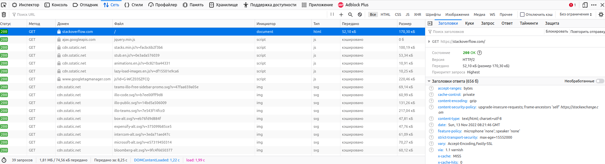
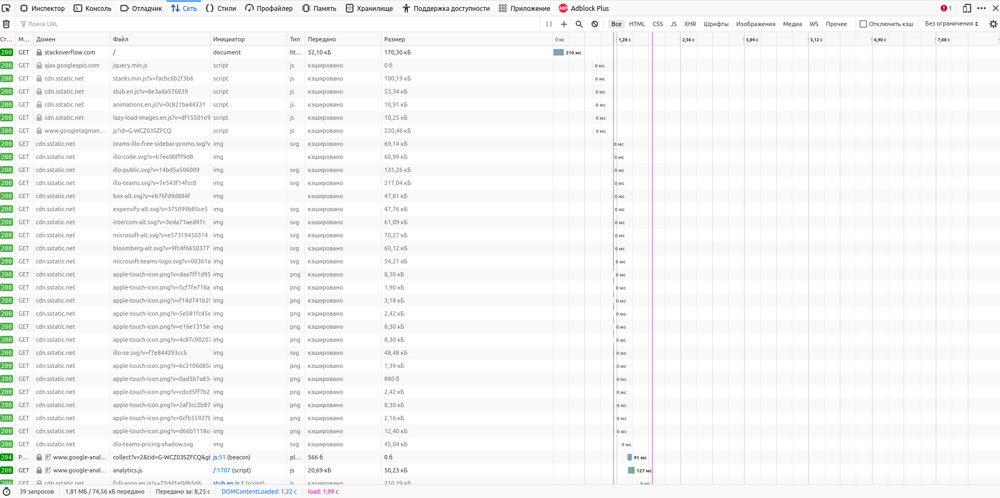

#Домашнее задание к занятию "3.6. Компьютерные сети. Лекция 1"
1. Подключился, получил ошибку 403 Forbidden — доступ к запрошенному ресурсу запрешён.
    ```
    alex@example ~ $ telnet stackoverflow.com 80
    Trying 151.101.1.69...
    Connected to stackoverflow.com.
    Escape character is '^]'.
    GET /questions HTTP/1.0
    HOST: stackoverflow.com
    
    HTTP/1.1 403 Forbidden
    Connection: close
    Content-Length: 1920
    Server: Varnish
    Retry-After: 0
    Content-Type: text/html
    Accept-Ranges: bytes
    Date: Sun, 13 Nov 2022 08:17:38 GMT
    Via: 1.1 varnish
    X-Served-By: cache-fra-eddf8230084-FRA
    X-Cache: MISS
    X-Cache-Hits: 0
    X-Timer: S1668327458.254184,VS0,VE2
    X-DNS-Prefetch-Control: off
    <skipped>
    Connection closed by foreign host.
    ```
2. Первый ответ сервера `GET https://stackoverflow.com/` пришёл с кодом 200 OK.
Этот же запрос обрабатывался дольше всего — 210 мс.


3. Узнать свой IP-адрес можно, например, с помощью веб-сервиса [eth0.me](http://eth0.me) (здесь и далее реальный IP-адрес изменён):
   ```
   alex@example ~ $ wget -qO- eth0.me
   1.2.3.4
   ```
4. IP-адрес принадлежит провайдеру МТС. Автономная система — AS13155.
   ```
   alex@example ~ $ whois 1.2.3.4 | grep descr
   descr:          MTS Irkutsk
   descr:          MTS Irkutsk Block
   alex@example ~ $ whois 1.2.3.4 | grep origin
   origin:         AS13155  
   ```
5. Выполнил команду `traceroute -IAn 8.8.8.8`. Результат выполнения:
   ```
   traceroute to 8.8.8.8 (8.8.8.8), 30 hops max, 60 byte packets
    1  78.109.37.42 [AS13155]  1.573 ms  1.592 ms  1.630 ms
    2  78.109.37.42 [AS13155]  1.679 ms  1.750 ms  1.797 ms
    3  212.188.44.133 [AS8359]  2.312 ms  2.350 ms  2.586 ms
    4  212.188.44.132 [AS8359]  2.084 ms  2.164 ms  2.451 ms
    5  212.188.29.137 [AS8359]  80.225 ms  80.253 ms  80.417 ms
    6  212.188.2.1 [AS8359]  26.191 ms * *
    7  195.34.50.153 [AS8359]  43.631 ms  43.635 ms  43.767 ms
    8  * * *
    9  * * *
   10  195.34.53.201 [AS8359]  73.197 ms  73.228 ms  73.415 ms
   11  209.85.149.166 [AS15169]  74.934 ms  74.982 ms  75.034 ms
   12  172.253.68.11 [AS15169]  73.460 ms  74.255 ms  74.350 ms
   13  108.170.250.66 [AS15169]  74.675 ms  74.795 ms  74.853 ms
   14  142.250.238.214 [AS15169]  90.104 ms  90.138 ms  90.452 ms
   15  142.250.235.74 [AS15169]  89.645 ms  89.781 ms  89.912 ms
   16  216.239.56.113 [AS15169]  91.005 ms  90.691 ms  90.628 ms
   17  * * *
   18  * * *
   19  * * *
   20  * * *
   21  * * *
   22  * * *
   23  * * *
   24  * * *
   25  * * *
   26  8.8.8.8 [AS15169]  88.207 ms  88.347 ms  88.558 ms
   ```
6. Выполнил команду `mtr -znr -o W 8.8.8.8`. Наибольшая задержка на участке 16. Результаты выполнения команды: 
    ```
    Start: 2022-11-13T16:55:02+0800
    HOST: example                      Wrst
     1. AS13155  78.109.37.42          1.5
     2. AS13155  78.109.37.42          1.5
     3. AS8359   212.188.44.133        2.0
     4. AS8359   212.188.44.132        4.5
     5. AS8359   212.188.29.137       87.1
     6. AS8359   212.188.2.1          27.5
     7. AS8359   195.34.50.153        54.0
     8. AS???    ???                   0.0
     9. AS8359   212.188.29.25        73.1
     10. AS8359   195.34.53.201        72.9
     11. AS15169  209.85.149.166       74.7
     12. AS15169  172.253.68.11        75.3
     13. AS15169  108.170.250.66       74.4
     14. AS15169  142.250.238.214      90.1
     15. AS15169  142.250.235.74       89.2
     16. AS15169  216.239.56.113       91.2
     17. AS???    ???                   0.0
     18. AS???    ???                   0.0
     19. AS???    ???                   0.0
     20. AS???    ???                   0.0
     21. AS???    ???                   0.0
     22. AS???    ???                   0.0
     23. AS???    ???                   0.0
     24. AS???    ???                   0.0
     25. AS???    ???                   0.0
     26. AS15169  8.8.8.8              88.5
   ```
7. Чтобы получить список DNS, выполнил команду `dig NS +short dns.google`:
   ```    
   ns1.zdns.google.
   ns3.zdns.google.
   ns4.zdns.google.
   ns2.zdns.google.
   ```
   Чтобы получить A-записи, выполнил команду `dig A +short dns.google`:
   ```
   8.8.8.8
   8.8.4.4
   ```
8. Проверил PTR-записи для IP-адресов 8.8.4.4 и 8.8.8.8. К адресам привязано доменное имя dns.google. 
   ```
   alex@example ~ $ dig -x 8.8.4.4 | grep PTR
   ;4.4.8.8.in-addr.arpa.		IN	PTR
   4.4.8.8.in-addr.arpa.	7182	IN	PTR	dns.google.
   alex@example ~ $ dig -x 8.8.8.8 | grep PTR
   ;8.8.8.8.in-addr.arpa.		IN	PTR
   8.8.8.8.in-addr.arpa.	7152	IN	PTR	dns.google.
   ```