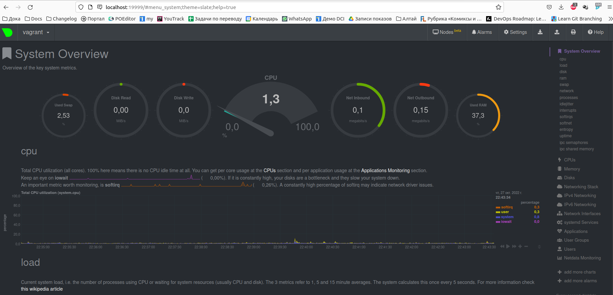

1. Создаём unit-файл `nano/etc/systemd/system/node-exporter-daemon.service` следующего содержания:
    ```
    [Unit]
    Description=Node Exporter

    [Service]
    ExecStart=/usr/bin/node_exporter $EXTRA_OPTS      

    [Install]
    WantedBy=multi-user.target
    ```
    Добавляем сервис в автозагрузку:
    ```
    sudo systemctl enable node-exporter-daemon
    ```
    Запускаем сервис:
    ```
    sudo systemctl start node-exporter-daemon
    ```
    Проверяем статус сервиса:
    ```
    sudo systemctl status node-exporter-daemon
    ```
    ```
     ● node-exporter-daemon.service - Node Exporter
      Loaded: loaded (/etc/systemd/system/node-exporter-daemon.service; enabled; vendor preset: enabled)
      Active: active (running) since Thu 2022-10-27 14:31:04 UTC; 49s ago
    Main PID: 62193 (node_exporter)
       Tasks: 8 (limit: 1065)
      Memory: 13.2M
      CGroup: /system.slice/node-exporter-daemon.service
              └─62193 /usr/bin/node_exporter
 
     Oct 27 14:31:04 vagrant node_exporter[62193]: ts=2022-10-27T14:31:04.145Z caller=node_exporter.go:115 level=info collector=thermal_zone
     Oct 27 14:31:04 vagrant node_exporter[62193]: ts=2022-10-27T14:31:04.145Z caller=node_exporter.go:115 level=info collector=time
     Oct 27 14:31:04 vagrant node_exporter[62193]: ts=2022-10-27T14:31:04.145Z caller=node_exporter.go:115 level=info collector=timex
     Oct 27 14:31:04 vagrant node_exporter[62193]: ts=2022-10-27T14:31:04.145Z caller=node_exporter.go:115 level=info collector=udp_queues
     Oct 27 14:31:04 vagrant node_exporter[62193]: ts=2022-10-27T14:31:04.145Z caller=node_exporter.go:115 level=info collector=uname
     Oct 27 14:31:04 vagrant node_exporter[62193]: ts=2022-10-27T14:31:04.145Z caller=node_exporter.go:115 level=info collector=vmstat
     Oct 27 14:31:04 vagrant node_exporter[62193]: ts=2022-10-27T14:31:04.145Z caller=node_exporter.go:115 level=info collector=xfs
     Oct 27 14:31:04 vagrant node_exporter[62193]: ts=2022-10-27T14:31:04.145Z caller=node_exporter.go:115 level=info collector=zfs
     Oct 27 14:31:04 vagrant node_exporter[62193]: ts=2022-10-27T14:31:04.146Z caller=node_exporter.go:199 level=info msg="Listening on" address=:9100
     Oct 27 14:31:04 vagrant node_exporter[62193]: ts=2022-10-27T14:31:04.147Z caller=tls_config.go:195 level=info msg="TLS is disabled." http2=false
     ```
    Останавливаем сервис:
    ```
    sudo systemctl stop node-exporter-daemon
    ```
    Проверяем статус:
    ```
    sudo systemctl status node-exporter-daemon
    ```
    ```
     ● node-exporter-daemon.service - Node Exporter
      Loaded: loaded (/etc/systemd/system/node-exporter-daemon.service; enabled; vendor preset: enabled)
      Active: inactive (dead) since Thu 2022-10-27 14:34:43 UTC; 1s ago
     Process: 62193 ExecStart=/usr/bin/node_exporter $EXTRA_OPTS (code=killed, signal=TERM)
     Main PID: 62193 (code=killed, signal=TERM)

     Oct 27 14:31:04 vagrant node_exporter[62193]: ts=2022-10-27T14:31:04.145Z caller=node_exporter.go:115 level=info collector=udp_queues
     Oct 27 14:31:04 vagrant node_exporter[62193]: ts=2022-10-27T14:31:04.145Z caller=node_exporter.go:115 level=info collector=uname
     Oct 27 14:31:04 vagrant node_exporter[62193]: ts=2022-10-27T14:31:04.145Z caller=node_exporter.go:115 level=info collector=vmstat
     Oct 27 14:31:04 vagrant node_exporter[62193]: ts=2022-10-27T14:31:04.145Z caller=node_exporter.go:115 level=info collector=xfs
     Oct 27 14:31:04 vagrant node_exporter[62193]: ts=2022-10-27T14:31:04.145Z caller=node_exporter.go:115 level=info collector=zfs
     Oct 27 14:31:04 vagrant node_exporter[62193]: ts=2022-10-27T14:31:04.146Z caller=node_exporter.go:199 level=info msg="Listening on" address=:9100
     Oct 27 14:31:04 vagrant node_exporter[62193]: ts=2022-10-27T14:31:04.147Z caller=tls_config.go:195 level=info msg="TLS is disabled." http2=false
     Oct 27 14:34:43 vagrant systemd[1]: Stopping Node Exporter...
     Oct 27 14:34:43 vagrant systemd[1]: node-exporter-daemon.service: Succeeded.
     Oct 27 14:34:43 vagrant systemd[1]: Stopped Node Exporter.
    ```
    Перезагружаем ВМ, аналогично убеждаемся, что сервис запущен.
2. Для мониторинга можно использовать следующие опции:
    - CPU: `node_cpu_seconds_total` 
    - RAM: `node_memory_MemTotal_bytes`, `node_memory_MemFree_bytes`, `node_memory_SwapFree_bytes`, `node_memory_SwapTotal_bytes` 
    - диск: `node_disk_info`, `node_disk_read_bytes_total`, `node_disk_written_bytes_total` 
    - сеть: `node_network_receive_packets_total`, `node_network_receive_drop_total`, `node_network_receive_errs_total`, `node_network_transmit_packets_total`, `node_network_transmit_drop_total`, `node_network_transmit_errs_total`
3. Установил Netdata, настроил перенаправление портов
    
4. Выполним команду `dmesg | grep -i virtual`.
    ```
    [    0.000000] DMI: innotek GmbH VirtualBox/VirtualBox, BIOS VirtualBox 12/01/2006
    [    0.007496] CPU MTRRs all blank - virtualized system.
    [    0.206449] Booting paravirtualized kernel on KVM
    [    6.321788] systemd[1]: Detected virtualization oracle. 
    ```
    Записи свидетельствуют, что ОС обнаружила систему виртуализации.
5. `fs.nr_open` —  это максимальное число файловых дескрипторов, которое может быть выделено для процесса. Значение по умолчанию —  1048576.
Этого значения помешает достичь лимит на максимальное число открытых файловых дескрипторов, задаваемый командой `ulimit -n`. Значение по умолчанию — 1024.
6. Выполним в терминале команду: 
    ```
    sudo -i unshare -f --pid --mount-proc sleep 1h 
    ```
    Откроем второй терминал и выполним в нём команду:
    ```
    ps aux | grep sleep
    ```
    ```
    root        2498  0.0  0.4   9260  4552 pts/2    S+   14:46   0:00 sudo -i unshare -f --pid --mount-proc sleep 1h
    root        2500  0.0  0.0   5480   580 pts/2    S+   14:46   0:00 unshare -f --pid --mount-proc sleep 1h
    root        2505  0.0  0.0   5476   520 pts/2    S+   14:46   0:00 sleep 1h
    ```
    Подключимся к созданному namespace:
    ```
    sudo -i nsenter --target 2505 --pid --mount
    ```
    Вызовем список процессов:
    ```
    ps aux
    ```
    ```
    USER         PID %CPU %MEM    VSZ   RSS TTY      STAT START   TIME COMMAND
    root           1  0.0  0.0   5476   520 pts/2    S+   14:46   0:00 sleep 1h
    root           2  0.1  0.4   7236  4032 pts/3    S    14:48   0:00 -bash
    root          13  0.0  0.3   8888  3324 pts/3    R+   14:48   0:00 ps aux 
    ```
7. Команда `:(){ :|:& };:` является логической бомбой, которая запускает бесконечное число процессов.
Изменить количество процессов можно с помощью команды `ulimit -u`. Значение по умолчанию — 3553.
