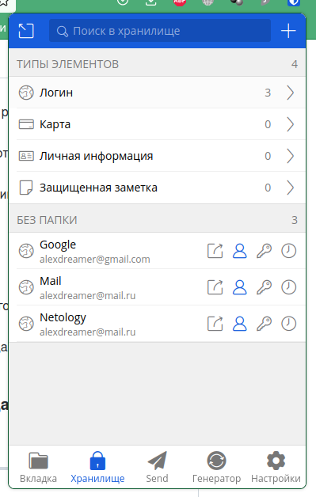
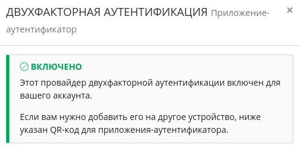
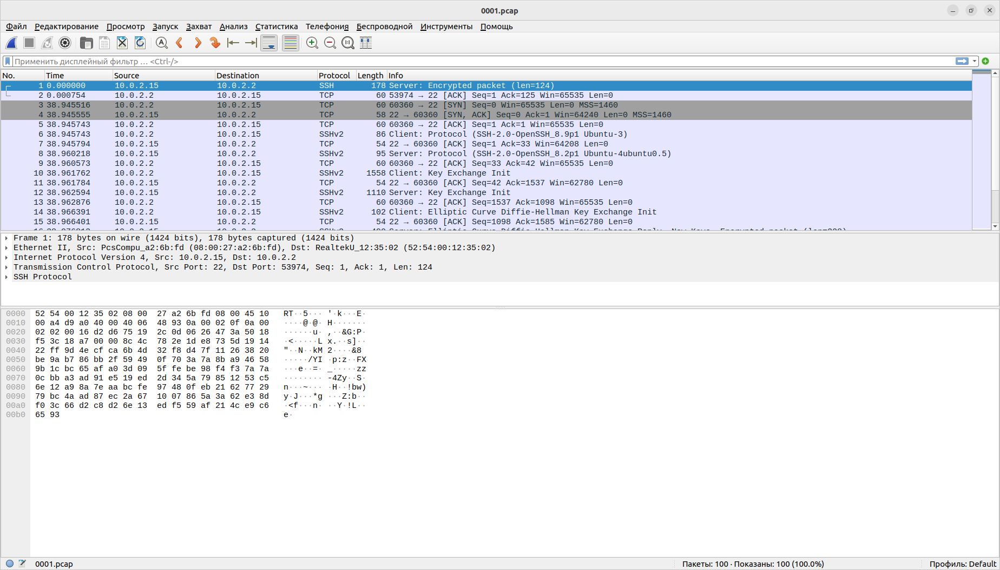

# Домашнее задание к занятию "3.9. Элементы безопасности информационных систем"

1. Установил плагин для Firefox. Сохранил несколько паролей.

    
2. Установил Google Authentificator. Подключил двухфакторную аутентификацию.

    
3. Выполнил команды:
    ```
    sudo apt update
    sudo apt install apache2
    sudo a2enmod ssl
    sudo systemctl restart apache2
    sudo openssl req -x509 -nodes -days 365 -newkey rsa:2048  \
    -keyout /etc/ssl/private/apache-selfsigned.key \
    -out /etc/ssl/certs/apache-selfsigned.crt \
    -subj "/C=RU/ST=Irkutsk/L=Irkutsk/O=My Company/OU=Org/CN=www.example.com"
    ```
    Создал конфиг **/etc/apache2/sites-available/10.0.2.15.conf**:
    ```
    <VirtualHost *:443>
    ServerName 10.0.2.15
    DocumentRoot /var/www/10.0.2.15

    SSLEngine on
    SSLCertificateFile /etc/ssl/certs/apache-selfsigned.crt
    SSLCertificateKeyFile /etc/ssl/private/apache-selfsigned.key
    </VirtualHost>
    ```
    Создал файл **/var/www/10.0.2.15/index.html**:
    ```
    <h1>Hello World!</h1>
    ```
    Выполнил команды:
    ```
    sudo a2ensite 10.0.2.15.conf
    sudo apache2ctl configtest
    sudo systemctl reload apache2
    ```
    Проверил работу сайта:
    ```
    curl -k https://10.0.2.15/index.html
    ```
    В ответ пришёл созданный index.html.
4. Выполнил команды:
    ```
    git clone --depth 1 https://github.com/drwetter/testssl.sh.git
    cd testssl.sh/
    ./testssl.sh -U --sneaky https://example.com
    ```
    Получил ответ:
    ```
    Testing vulnerabilities 

    Heartbleed (CVE-2014-0160)                not vulnerable (OK), no heartbeat extension
    CCS (CVE-2014-0224)                       not vulnerable (OK)
    Ticketbleed (CVE-2016-9244), experiment.  not vulnerable (OK)
    ROBOT                                     not vulnerable (OK)
    Secure Renegotiation (RFC 5746)           supported (OK)
    Secure Client-Initiated Renegotiation     not vulnerable (OK)
    CRIME, TLS (CVE-2012-4929)                not vulnerable (OK)
    BREACH (CVE-2013-3587)                    potentially NOT ok, "gzip deflate" HTTP compression detected. - only supplied "/" tested
                                           Can be ignored for static pages or if no secrets in the page
    POODLE, SSL (CVE-2014-3566)               not vulnerable (OK)
    TLS_FALLBACK_SCSV (RFC 7507)              Downgrade attack prevention supported (OK)
    SWEET32 (CVE-2016-2183, CVE-2016-6329)    not vulnerable (OK)
    FREAK (CVE-2015-0204)                     not vulnerable (OK)
    DROWN (CVE-2016-0800, CVE-2016-0703)      not vulnerable on this host and port (OK)
                                           make sure you don't use this certificate elsewhere with SSLv2 enabled services, see
                                           https://search.censys.io/search?resource=hosts&virtual_hosts=INCLUDE&q=7F2FE8D6B18E9A47839256CD97938DAA70E8515750298DDBA2F3F4B8440113FC
    LOGJAM (CVE-2015-4000), experimental      not vulnerable (OK): no DH EXPORT ciphers, no common prime detected
    BEAST (CVE-2011-3389)                     TLS1: ECDHE-RSA-AES128-SHA
                                                 ECDHE-RSA-AES256-SHA
                                                 DHE-RSA-AES128-SHA
                                                 DHE-RSA-AES256-SHA
                                                 DHE-RSA-CAMELLIA256-SHA
                                                 DHE-RSA-CAMELLIA128-SHA
                                                 AES256-SHA CAMELLIA256-SHA
                                                 AES128-SHA CAMELLIA128-SHA
                                                 DHE-RSA-SEED-SHA SEED-SHA 
                                           VULNERABLE -- but also supports higher protocols  TLSv1.1 TLSv1.2 (likely mitigated)
    LUCKY13 (CVE-2013-0169), experimental     potentially VULNERABLE, uses cipher block chaining (CBC) ciphers with TLS. Check patches
    Winshock (CVE-2014-6321), experimental    not vulnerable (OK)
    RC4 (CVE-2013-2566, CVE-2015-2808)        no RC4 ciphers detected (OK)
    ```
5. Поднял SSH-сервер на ВМ:
    ```
    sudo apt install openssh-server
    sudo systemctl start sshd.service
    sudo systemctl enable sshd.service
    ```
    Создал SSH-ключ и скопировал его на сервер:
    ```
    ssh-keygen
    ssh-copy-id -p 2222 vagrant@127.0.0.1 
    ```
    Подключился к ВМ:
    ```
    ssh -p 2222 vagrant@127.0.0.1
    ```
6. Скопировал ключ:
    ```
    cp ~/.ssh/id_rsa ~/.ssh/my_vm.key
    ```
    Создал конфигурационный файл SSH:
    ```
    touch ~/.ssh/config && chmod 600 ~/.ssh/config
    ```
    Содержимое файла:
    ```
    Host my_vm
      HostName 127.0.0.1
      IdentityFile ~/.ssh/my_vm.key
      User vagrant
      Port 2222
    Host *
      User alex
      Identityfile ~/.ssh/id_rsa
    ```
    Подключился к ВМ:
    ```
    ssh my_vm
    ```
7. Выполнил команды:
    ```
    sudo apt install tcpdump
    sudo tcpdump -w 0001.pcap -c 100 -i eth0
    sudo apt install wireshark-qt
    ```
    Открыл файл в Wireshark:

    